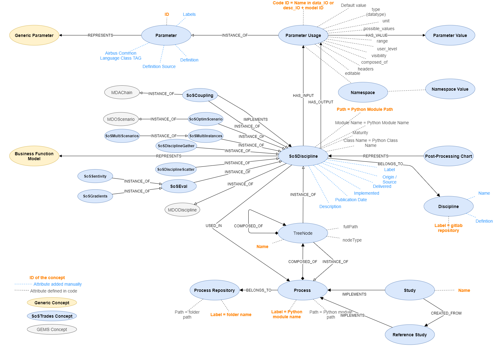

# SoS Ontology

This is SoSTrades Ontology project.
It contains:
 - the SoSTrades TBox (the ontology classes) used to create the SoSTrades ontology
 - all the necessary code to generate the SoSTrades Ontology from parsing the Python code
 - the SoSTrades Ontology API server and code

## SoSTrades Ontology install
`pip install -r requirements.txt --trusted-host pypi.org --trusted-host files.pythonhosted.org`

## API Start
If you want to run the ontology API locally:

`python \rest_api\api.py`

## Update Ontology

The update process can be done through a Jenkins job by running `ontology\sos_ontology\core\script\createSoSOntologyFromCode.py`

### Prerequisite
To be able to run correctly this script:
 - ALL repositories must be cloned on the local environment and present on the Python PATH otherwise the models / process of the repositories that are not present will not appear on the updated ontology

### Update process

### Files generated
Once the script is DONE, it will have created the files:
 - `\data\sos_ontology\SoSTrades_Ontology_ABox_Decentralized.owl`
 - `\data\logs\ontologyCreationLogs.json`
 - `\data\terminology\SoS_Trades_Terminology_ABox.xlsx`

## Ontology metadata
The ontology contains entities and information extracted from the code.
Each entity can be complemented with metadata like `label` or `description`. For that, these information must be stored in a specific format.
 - For **Process Repository**, metadata are located in the file `__init__.py` present in the folder of the process repository:
   - `label`= `<Human readable name for the process repository>`
   - `description`= `<Process repository description>`
 - For **Process**, metadata are located in the ProcessBuilder Class of the process, in a class parameter named `_ontology_data`:
   - `_ontology_data: {`
     - `'label': <Human readable name for the process>,`
     - `'description': <Process description>,`
     - `'category': <Category of the process. Useful for search / classification>,`
     - `'version': <Process version (development, production, v1,...>,}`
 - For **Discipline**, metadata are located in the SoSDiscipline  Class of the discipline, in a class parameter named `_ontology_data`:
   - `_ontology_data: {`
     - `'label': <Human readable name for the sos discipline>,`
     - `'type': <same as maturity ⇒ Official, Research, Fake>,`
     - `'source': <which department the sos discipline is coming from>,`
     - `'validated': <is it validated ?>,`
     - `'validated_by': <if it is validated, which organisation did the validation>,`
     - `'last_modification_date': <date of last modification (MM/YYYY)>,`
     - `'category': <Category of the sos discipline. Useful for search / classification>,`
     - `'definition': <what is the sos discipline doing / calculating>,`
     - `'icon': <icon name from https://fontawesome.com/search?m=free&s=solid%2Cbrands,`
     - `'version': <SoSDiscipline version (development, production, v1,...>,`
   - For the icons, the class name is always like fa-<ICONNAME> can be personalised.
Using prefixes: fas for solid style, far for regular, fal for light, fad for duotone
Same width icon with adding suffix fa-fw
 - For **Parameters**, metadata are located in a `parameters_glossary.csv` file at the root folder of each repository.
   - `Id: name of parameter in the code`
   - `Label: human readable label for the parameter`
   - `Unit: unit of the parameter`
   - `Definition: definition of the parameter`
   - `DefinitionSource: source information for the definition if relevant`
   - `ACLTag: Airbus Common Language Tag`
## Ontology Repository Details
### Code Details

#### **\core\functions\ontology_to_terminology.py**

Function able to transform any Ontology content into an SoSTerminology. Basically it exports an OWL Ontology into an Excel file.
#### **\core\functions\sendGChatNotifications.py**

Function use to send notification on Google Chat via webhook. It is used at the end of the update script to inform users about the status of the update.

#### **\core\script\createSoSOntologyFromCode.py**

Script to generate the SoSTrades Ontology from the parsing of the all repositories code.
#### **\core\sos_entities\\...**

Classes that represent each ontology entity used during the update script.

#### **\core\ontology.py**

Class defining an Ontology based on RDFLib. It contains basic function to load OWL file, explorer them and update them.

#### **\core\sos_decentralized_codedataextractor.py**

Class to read and parse Python code to look for entities and generate sos entities class instances for each.

#### **\core\sos_ontology.py**

SoS_Ontology class that uses the Ontology class and implement it for the SoS Ontology
It adds specific methods to interact with the SosTrades Ontology

#### **\core\sos_terminology.py**

SoS_Terminology class based on openpyxl to interact with Excel files. Allows to open, edit, saves files.

#### **\core\sos_toolbox.py**

SoS_Toolbox class that contains common methods that can be used everywhere

### Files Details

#### **\data\sos_ontology\SoSTrades_Ontology_ABox_Decentralized.owl**

Generated version of the SoSTrades Ontology with all the classes and individuals

#### **\data\sos_ontology\SoSTrades_Ontology_TBox.owl**

ABox for the SoSTrades Ontology. It contains all the OWL classes but without the instances. It is the base from which we construct the SoSTrades ontology.

#### **\data\terminology\SoS_Trades_Terminology_ABox.xlsx**

This file is an Excel export of the current SoSTrades Ontology. It is generated by the update_ontology script
#### **\data\logs\SoS_Trades_Terminology_ABox.xlsx**

This file contains all the logs generated by the last ontology update script. There are information logs, warning logs and errors logs inside

## SoSOntology Concept

Details of the concepts (classes) in the SoSTrades Ontology

## License
The sostrades-ontology source code is distributed under the Apache License Version 2.0.
A copy of it can be found in the LICENSE file.

The sostrades-ontology product depends on other software which have various licenses.
The list of dependencies with their licenses is given in the CREDITS.rst file.